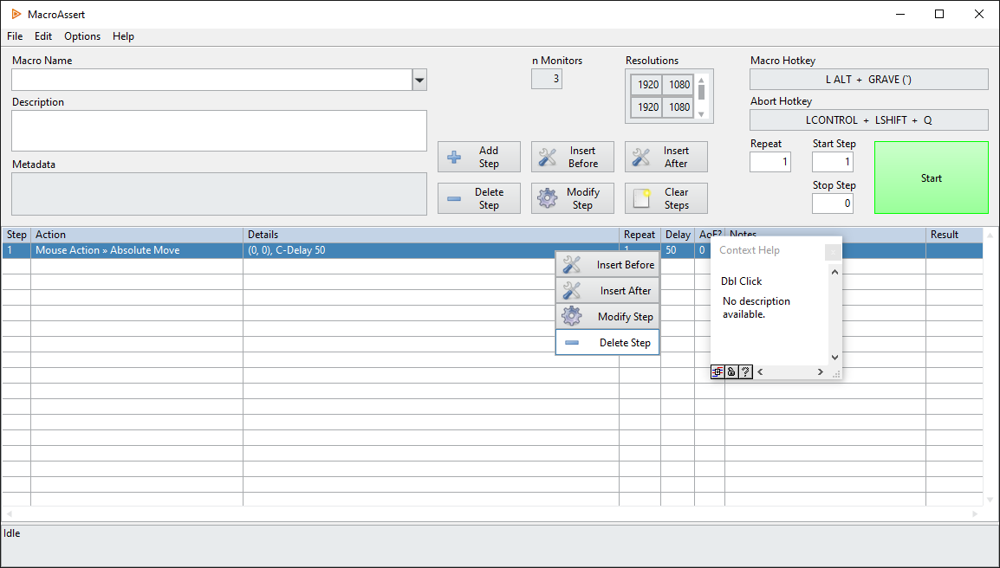

# Control callouts
{: .no_toc }

---

# Introduction

Many step subtypes require a unique control to be specified. In most cases, the label of the control is enough to uniquely identify that control. In more complex front panel implementations, however, the label itself may not be enough. There are two main situations in which a front panel may have two of the same control name: controls within clusters, and controls inside subpanels. This section outlines several methods that can be used to call out those control names.

# Qualified notation

The algorithm that finds the specified control within a front panel accepts a "qualified control" notation, which is achieved by using double colons (`::`) to specify the container of the control. As an example, take a look at the main panel of the MacroAssert tool itself:

The cluster that appears when a step is double clicked is labeled **Dbl Click**. Within that cluster, there are four buttons with the following labels: **Insert Before**, **Insert After**, **Modify Step**, and **Delete Step**. However, buttons with those same labels exist on the front panel as well. If a step calls out `Delete Step`, the step will result in an error due to multiple controls of the same label being found.

The first method to call out these controls uniquely is to specify `[CONTAINER_LABEL]::[CONTROL_LABEL]`. If a step calls out `Dbl Click::Delete Step`, for example, that will uniquely specify the button within the cluster. This is more specific than the next method.

Another method to call out the controls uniquely is to specify `@[CONTAINER_CLASS]::[CONTROL_LABEL]`. If a step calls out `@Cluster::Delete Step`, for example, that will uniquely specify the button within the cluster. This is more generic than the previous method.

Each method has tradeoffs in terms of specificity and modularity. Method 2 would be the preferred method here, as it will still work even if **Dbl Click** is changed to a different label. However, if a front panel contains multiple clusters with a **Delete Step** button in them, method 1 would then be necessary to call out the **Delete Step** button within a specific cluster.

These methods can be combined to call out controls that are nested more than one level deep. For example, a control within a cluster within a subpanel can be called out by entering `@SubPanel::[CLUSTER_LABEL]::[CONTROL_LABEL]`.

# Remarks

The ability for the tool to identify controls within subpanels when being ran on a remote application instance is not fully implemented.