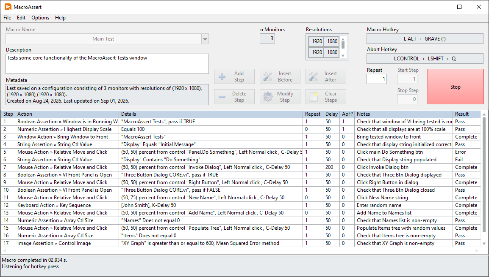

# MacroAssert

 

MacroAssert is a free, open-source tool that allows the user to create sequences of highly configurable steps that can be used to test user interfaces. The goal is to provide an intuitive tool for creating reliable UI tests that are agnostic to changes in display scale, monitor resolution, and front panel control positions.

## Features

- No-code framework: tests are configured through a GUI and are stored as INI files, meaning no LabVIEW experience is needed to create tests
- Mouse actions can be configured to be relative to a front panel control or window, in either pixels or percent
- Keyboard actions have support for <kbd>Ctrl</kbd>, <kbd>Alt</kbd>, and <kbd>Shift</kbd> modifiers
- Support for various other actions, such as maximizing and minimizing windows and waiting until a set time of day
- Long list of assertions that can be used, such as verifying front panel control values, verifying the frontmost window name, verifying that a window is fully on-screen, and many more
- Ability to connect remotely to a runtime application to run tests on it
- Ability to generate HTML reports of results

## Requirements

- LabVIEW 2020 or newer
- Windows 10 or newer
- VI Package Manager

## Getting started

- Download and install the latest version of the tool. It can be found by searching for it on VI Package Manager. It can also be found on [vipm.io](https://www.vipm.io/package/redhawk_lib_macroassert) and in the [Releases](https://github.com/FireFist-Redhawk/MacroAssert/releases) section of the repository.
- After being installed, it is integrated into the LabVIEW development environment and can be launched by clicking <b>Tools &rarr; Redhawk &rarr; MacroAssert</b> in any LabVIEW window.

## Support

At the time of writing, this project is actively maintained. If you find a bug or have a suggestion for an improvement, [create an issue](https://github.com/FireFist-Redhawk/MacroAssert/issues) on GitHub.

## Contributing

If you find this tool useful, please consider starring the VIPM package and Github repository to show your support. If you would like to contribute directly, fork the `develop` branch of the repository and open a pull request.

## Kudos

I have used resources from other people to achieve some of the functionality of this tool. I wanted to recognize those people here.

- rolfk for making a [this library](https://forums.ni.com/t5/LabVIEW/How-to-run-an-exe-as-a-window-inside-a-VI/m-p/4096356#M1179928), which is a 64-bit-compatible version of [WINUTL.LLB](https://forums.ni.com/t5/Example-Code/Windows-API-Function-Utilities-32-bit-for-LabVIEW/ta-p/3996462).
- Hooovahh for making [these VIs](https://forums.ni.com/t5/LabVIEW/Get-Mouse-Cursor/m-p/3229067#M938933), which get the image of a mouse cursor icon.
- paul_a_cardinale for making [this VI](https://forums.ni.com/t5/LabVIEW/All-VIs-in-Memory-Including-Clones/m-p/4414553#M1301272), which gets all clones of a VI.
- crossrulz for making [this VI](https://github.com/ni/labview-icon-editor/blob/develop/resource/plugins/NIIconEditor/User%20Dialogs/SubVIs/Center%20Dialog%20on%20Caller.vi), which centers a dialog on the calling VI.
- dadreamer for [these posts](https://forums.ni.com/t5/Community-Documents/Simulated-Keyboard-Entries-Using-User32-DLL-Functions/ta-p/3539441), which explain (1) how make [SendInput](https://learn.microsoft.com/en-us/windows/win32/api/winuser/nf-winuser-sendinput) work in either 32-bit or 64-bit, and (2) how the <kbd>Return</kbd> key creates an edge case that needs to be accounted for.